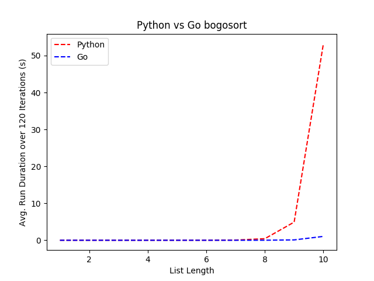
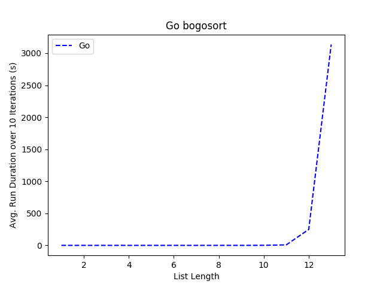

# boGoSort/ Bad Sorts
### Inspiration   
http://richardhartersworld.com/cri_d/cri/2001/badsort.html  
  
I was interested in learning a compiled language that wasn't C, 
and Go caught my eye.  After reading through their FAQ to understand 
the design choices and why it was made, I was hooked.  To learn a litle
about the language to see if I like it I decided to write the simple
Bogo sort ([Wikipedia link](https://en.wikipedia.org/wiki/Bogosort)).  This has since evolved
into an interest in terrible sorting algorithms.

Since I already had experience with Python, it seemed like it would be interesting to see what kind of speed differences I would see between it and a compiled language like Go.  

### Setup
To run the comparison `compare.py`, you need matplotlib installed with pip and tkinter on your system.  
``` 
sudo apt-get install python3-tk
```

You will also need a `bogosort/python/config.py` file:
```
iterations = 90
length = 8
bin_name = "bogosort"
```

This assumes you have already built the executable referenced by `bin_name` and it resides at `bogosort/bin_name`.  


### Results
- The average number of permutations needed to succeed per language approach each other the more iterations that are given.
- Since I want to run a signifcant number of iterations to get a good average, once the # iterations * avg duration looks like/ does take more than an hour I will cut it off and do anything at or above that point in smaller iterations to continue the data.

#### Bogosort
Running with 120 iterations per list item:  
(Had to restart and cull it to just 10 items, since with Python after 10 items it gets unwieldy. Once my server is back up and running I'll run some longer tests and really see how bad sorts can be).  
For reference, with 10 runs on list of 11:  
Average permutations: 33744383.200000  
Average time: 569.044465s  

```
Running lists of length 1...
Go avg perm: 0.000000 avg_dur: 0.000000
Py avg perm: 0.000000 avg_dur: 0.000001
Running lists of length 2...
Go avg perm: 1.070000 avg_dur: 0.000000
Py avg perm: 1.350000 avg_dur: 0.000005
Running lists of length 3...
Go avg perm: 5.830000 avg_dur: 0.000001
Py avg perm: 4.341667 avg_dur: 0.000020
Running lists of length 4...
Go avg perm: 18.660000 avg_dur: 0.000003
Py avg perm: 21.433333 avg_dur: 0.000129
Running lists of length 5...
Go avg perm: 115.700000 avg_dur: 0.000022
Py avg perm: 136.516667 avg_dur: 0.001011
Running lists of length 6...
Go avg perm: 785.330000 avg_dur: 0.000167
Py avg perm: 702.525000 avg_dur: 0.006361
Running lists of length 7...
Go avg perm: 5059.010000 avg_dur: 0.001192
Py avg perm: 4445.816667 avg_dur: 0.045104
Running lists of length 8...
Go avg perm: 40861.070000 avg_dur: 0.010565
Py avg perm: 36274.891667 avg_dur: 0.429880
Running lists of length 9...
Go avg perm: 297271.580000 avg_dur: 0.094934
Py avg perm: 368642.975000 avg_dur: 4.912837
Running lists of length 10...
Go avg perm: 3055861.020000 avg_dur: 1.044706
Py avg perm: 3614541.141667 avg_dur: 53.255723
```


Both languages appear to increase by about a factor of 10 for each item added to the list.  
And here's a graph of just Go to see it clearer:
```
Running lists of length 1...
Go avg perm: 0.000000 avg_dur: 0.000000
Running lists of length 2...
Go avg perm: 1.000000 avg_dur: 0.000000
Running lists of length 3...
Go avg perm: 4.300000 avg_dur: 0.000001
Running lists of length 4...
Go avg perm: 26.500000 avg_dur: 0.000004
Running lists of length 5...
Go avg perm: 96.900000 avg_dur: 0.000017
Running lists of length 6...
Go avg perm: 744.600000 avg_dur: 0.000152
Running lists of length 7...
Go avg perm: 5966.000000 avg_dur: 0.001697
Running lists of length 8...
Go avg perm: 45981.700000 avg_dur: 0.014156
Running lists of length 9...
Go avg perm: 458199.700000 avg_dur: 0.142002
Running lists of length 10...
Go avg perm: 3025537.900000 avg_dur: 1.062398
Running lists of length 11...
Go avg perm: 20557051.400000 avg_dur: 7.968405
Running lists of length 12...
Go avg perm: 572142136.600000 avg_dur: 248.155413
Running lists of length 13...
Go avg perm: 6710423866.200000 avg_dur: 3135.939127
```


